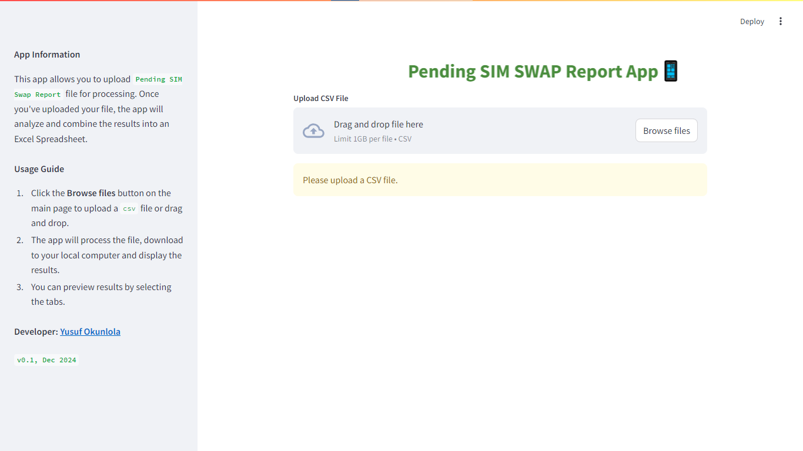

## Pending SIM Swap Report App
This app analyzes pending SIM Swap report and combine the results into an Excel Spreadsheet.

### Package Installation
- Download the executable file `.exe` via [Google Drive](https://drive.google.com/file/d/1gU_rw8OoqZDk6c3kDgz07cP2VrSq3lyC/view?usp=sharing) on your local computer.
- Run the app, a window console will come up, thereafter the app will be launched on your bowser via `http://localhost:8501/`.

### Technologies Used
- Pandas: A Python data manipulation and analysis library.
- Streamlit: An open-source app framework for building interactive data applications.

### Version History
- v0.1; Dec 13, 2024

### Developer
[Yusuf Okunlola](https://www.linkedin.com/in/yusufokunlola/)

### App Interface

